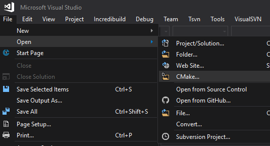

## Conda (Anaconda)

Conda er et anbefalt grensesnittet for installasjon av Proj. Conda (Anaconda) fungerer på Windows, Mac og de fleste Linux-varianter. Dessuten vil pakkene for Proj alltid være oppdatert til siste versjon ved installasjon via Conda.

Link til installasjon av Conda (Anaconda/Miniconda) på ulike plattformer:

* [https://docs.conda.io/projects/conda/en/latest/user-guide/install/index.html](Anaconda installasjon)

Kommando for installasjon i Conda:
> conda install -c conda-forge proj

Erfaringsvis kan man med denne kommandoen risikere å installere forelda versjonen av pakken.

Tilgjengelige versjoner kan søkes opp ved:
> conda search proj

Hvis Proj-versjonene for kanalen "conda-forge" ikke er tilgjengelig kan man legge den til ved:
> conda config --add channels conda-forge

Installer så et spesifikt build- og versjonsnummer ved:
> conda install proj=< versjon >=< buildnummer >

Kommando for sjekke installert proj-versjon:

> proj


### Proj-data

Proj er også avhengig av tilgang på ressursfiler for transformasjonene. Eksempel på ressursfiler kan være griddfiler, json-filer og proj.db-databasen. Flere av de norske transformasjonene er avhengig av nedlasting av ressursfiler fra *Proj-data* for å fungere.		

* [Proj-data på Github](https://github.com/OSGeo/PROJ-data)
* [Proj-data på CDN](https://cdn.proj.org/)

Installasjon av Proj-data med conda:
> conda install -c conda-forge proj-data

Filene vil da legges på mappestrukten:

Windows:

```
Anaconda-mappe
└───Library
    └───share
        └───proj
```

Linux:

```
Anaconda-mappe
└───share
        └───proj
```

### Mappestruktur ved installasjon av Proj

Ved standard installasjon av Proj ved Conda vil Proj legge seg lokalt etter flg. mappe-struktur: \

Med Windows:

```
Anaconda-mappe
└───Library
    │
    └───bin
    │   │   bin-filer
    │   │   dll-filer
    │
    └───include
    │   │   proj.h
    │   └───proj
    │       │   h-filer for osgeo.proj (ISO19111:2019)
    │
    └───lib
    │   │  lib-filer
    │
    └───share
        └───proj
            │   proj.db
            │   ressursfiler
```

Med Linux:

```
Anaconda-mappe eller  usr/local
│
└───bin
│   │   Executable
│
└───include
│   │   proj.h
│   └───proj
│       │   h-filer for osgeo.proj (ISO19111:2019)
│
└───lib
│   │   .so
│
└───share
        └───proj
            │   proj.db
            │   ressursfiler
```

Proj vil kunne lete etter flere lokale mapper hvor ressursfilene er plassert. Kommando for finne aktuelle mapper:
> projinfo --searchpaths

#### projsync

For nedlasting av ressursfiler kan man kjøre kommandoen "projsync". Ressursfilene hentes fra skytjenesten https://cdn.proj.org/ og er egentlig en speiling av proj-data (https://github.com/OSGeo/PROJ-data/).

Laste ned ressursfiler for norske områder:
> projsync --bbox 2,57,32,82

Dersom alle ressursfiler skal lastes ned så kjør:
> projsync --all

Ved synking ved projressurser vil filene plasseres på omådet		

Med Windows:

```
c:\User\< username >\AppData\Local\proj
```

Med Linux:

```
/.local/share/proj
```

#### Miljøvariabel *PROJ_LIB*

Stien til ressursfilene kan også settes manualt med miljøvariabelen PROJ_LIB. Da vil denne stien få førsteprioritet.

> set PROJ_LIB=< lokal sti >

For å fjerne PROJ_LIB:

> set PROJ_LIB=

### Proj.db

Proj.db er en relasjonsdatabase på SQLite. Databasen sitt innhold er hentet fra [EPSG-registeret](https://epsg.org/search/by-name) samt egne data for Proj. Proj.db oppdateres og synkroniseres mot EPSG-registeret kontinuelig.

Proj.db må være på plass for koordinatransformasjoner med bruk av EPSG-koder.

## Docker

Hente docker image:
> docker pull osgeo/proj

Liste docker image av Proj:
> docker images osgeo/proj

Kjøre imaget som en kontainer:
> docker container run -dt -p XXXX:80 osgeo/proj

Liste kjørende kontainere:
> docker ps

Liste alle tilgjengelige kontainere:
> docker ps -a

Eksempel transformasjon fra ITRF2014 til EUREF89 med dockerkontainer:
> docker exec -it <container_name> cs2cs -d 10 EPSG:9000 EPSG:4937 \
> 60 10 100 2021.5 
59.9999949042   9.9999914938 99.8591580065 2021.5

Stoppe docker container
> docker container stop <container_name>

## Debugging av Proj

Kildekoden på Proj ligger som nevnt på GitHub.

Kloning Proj:
> git clone https://github.com/OSGeo/PROJ.git

### cmake

Bygge Proj i Linux:
> cd proj \
> make


### cmake i Visual Studio

Proj kan kompileres og bygges i Visual Studio (2015/2017/2019) dersom cmake er installert.

* Klon Proj fra GitHub
* Start VS
* Åpne repoet som Cmake




### vcpkg

Oppskrift på installasjon av vcpkg:
https://docs.microsoft.com/en-us/cpp/build/vcpkg?view=vs-2019

Oppskrift bygging og installasjon av Proj vha. vcpkg:
https://proj.org/install.html#building-on-windows-with-vcpkg-and-visual-studio-2017-or-2019


Opprett ei mappe for installasjon av vcpkg:
> C:\Tools>

Klon vcpkg fra Mircosoft sin GitHub:
> git clone https://github.com/microsoft/vcpkg

Gå til vcpkg:
> cd vcpkg

Installer vcpkg med bootstrap:
> bootstrap-vcpkg.bat

Hvis Visual Studio er installer på maskin så må vcpkg og VS integreres:
> vcpkg integrate install

#### Installere nødvendige pakker

Proj er i hovedsak avhengig av disse pakkene:

* sqlite3
* curl
* tiff

Installer så ulike pakker som Proj er avhengig av (64 bits):
> vcpkg install sqlite3[core,tool]:x64-windows tiff:x64-windows curl:x64-windows eigen3[core]:x64-windows

Tilsvarande for 32 bits:
> vcpkg install sqlite3[core,tool]:x86-windows tiff:x86-windows curl:x86-windows eigen3[core]:x86-windows


#### Bygge PROJ

Clone Proj kildekode fra GitHub:
> C:\Tools\vcpkg>cd .. \
> git clone https://github.com/OSGeo/PROJ.git \
> cd PROJ

Opprette byggemappe for Proj:

> md build \
> cd build

Opprett VS-prosjekter med cmake

64 bits:
> cmake -DCMAKE_GENERATOR_PLATFORM=x64 -Ax64 -DCMAKE_CL_64=1 -DVCPKG_TARGET_TRIPLET=x64-windows -DCMAKE_TOOLCHAIN_FILE=C:\Tools\vcpkg\scripts\buildsystems\vcpkg.cmake ..

32 bits:
> cmake -DCMAKE_TOOLCHAIN_FILE=C:\Tools\vcpkg\scripts\buildsystems\vcpkg.cmake ..

Bygging i debug:
> cmake --build . --config Debug -j 8

Bygging i release:
> cmake --build . --config Release -j 8


## Proj API

Proj har sitt eget interne API i C/C++ hvor mye av funksjonaliteten i Proj er gjort tilgjengelig. Basisfunksjonaliteten ligger i C-API'et.

I C-API'et må man referere headerfilen proj.h i tillegg til enten statisk eller dynamisk proj-bibliotek (proj.lib/proj.dll).

Eksempel på kall av C-API:

```
#include <stdio.h>
#include <proj.h>

int main (void) {
   PJ_CONTEXT *C;
   PJ *P;
   PJ *norm;
   PJ_COORD a, b;

   /* or you may set C=PJ_DEFAULT_CTX if you are sure you will */
   /* use PJ objects from only one thread */
   C = proj_context_create();

   P = proj_create_crs_to_crs (C,
   "EPSG:4326",
   "+proj=utm +zone=32 +datum=WGS84", /* or EPSG:32632 */
   NULL);

   if (0 == P) {
   fprintf(stderr, "Failed to create transformation object.\n");
   return 1;
   }

   /* This will ensure that the order of coordinates for the input CRS */
   /* will be longitude, latitude, whereas EPSG:4326 mandates latitude, */
   /* longitude */
   norm = proj_normalize_for_visualization(C, P);
   if (0 == norm) {
   fprintf(stderr, "Failed to normalize transformation object.\n");
   return 1;
   }
   proj_destroy(P);
   P = norm;

   /* a coordinate union representing Copenhagen: 55d N, 12d E */
   /* Given that we have used proj_normalize_for_visualization(), the order of
   /* coordinates is longitude, latitude, and values are expressed in degrees. */
   a = proj_coord(12, 55, 0, 0);

   /* transform to UTM zone 32, then back to geographical */
   b = proj_trans(P, PJ_FWD, a);
   printf("easting: %.3f, northing: %.3f\n", b.enu.e, b.enu.n);
   b = proj_trans(P, PJ_INV, b);
   printf("longitude: %g, latitude: %g\n", b.lp.lam, b.lp.phi);

   /* Clean up */
   proj_destroy(P);
   proj_context_destroy(C); /* may be omitted in the single threaded case */
}
```

* [Referanse til C-API i Proj](https://proj.org/development/quickstart.html)

### libproj

Proj C-API kan også linkes inn som CRAN (Comprehensive R Archive Network).

* [Link til libproj](https://github.com/paleolimbot/libproj)
