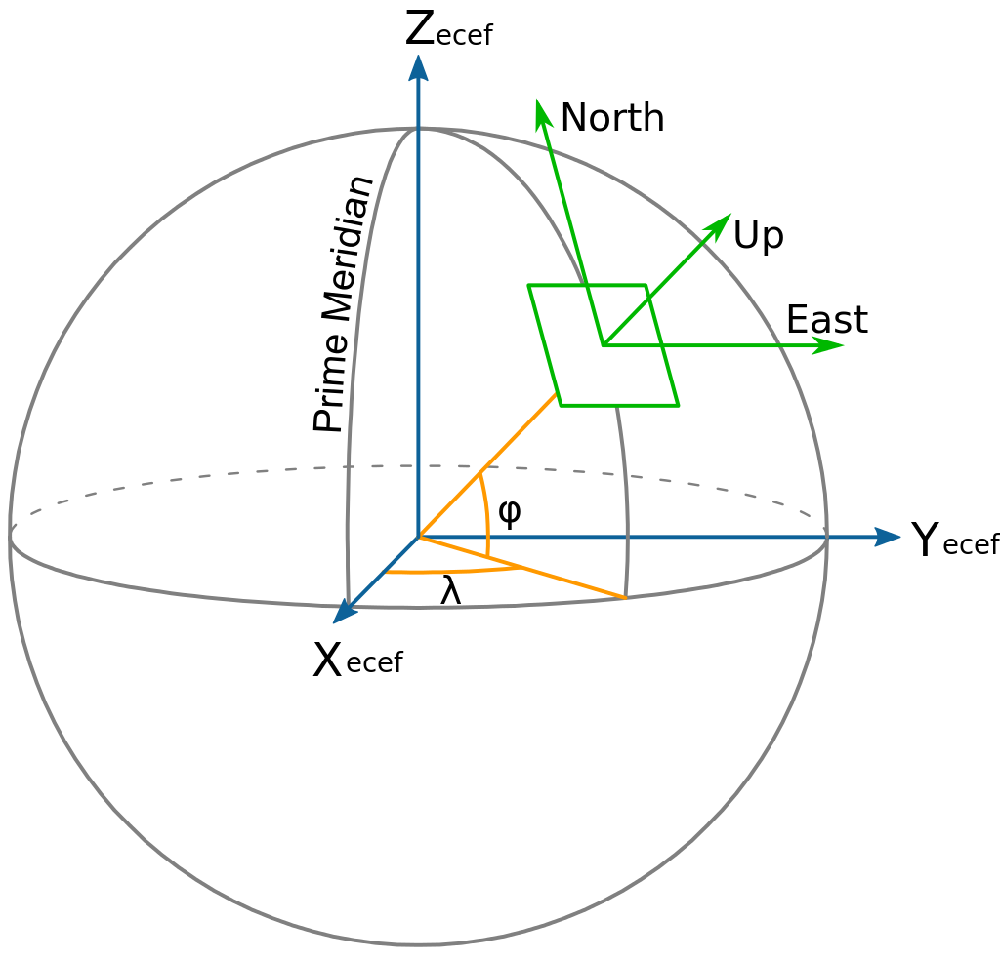

## Konverteringer

Begrepet konvertering innebærer å endre måten koordinater representeres på innen den samme referanseramme. Som et eksempel kan koordinater for EUREF89 vises som jordsentrisk, geografiske eller projiserte koordinater. Projiserte koordinater kan være EUREF89 UTM eller EUREF89 NTM.		

<!-- Original link: https://en.wikipedia.org/wiki/Local_tangent_plane_coordinates#/media/File:ECEF_ENU_Longitude_Latitude_relationships.svg -->

## Transformasjoner

Begrepet transformasjon innbærer å skifte referanseramme for en koordinat, for eksempel å transformasjonere en koordinat fra EUREF89 til ED50.

### Horisontale datumtransformasjoner

Ved horisontale (datum)transformasjoner bytter man referanseramme for en grunnrisskoordinat.

### Vertikale datumtransformasjoner

Vertikal (datum)transformasjoner bytter man vertikal referanseramme for en koordinat. Et eksempel på vertikal datumtransformsjoner er å bytte fra NN2000 til Sjøkartnull.

### Dynamiske transformasjoner

